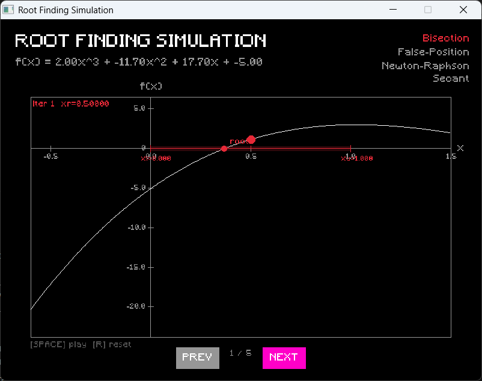
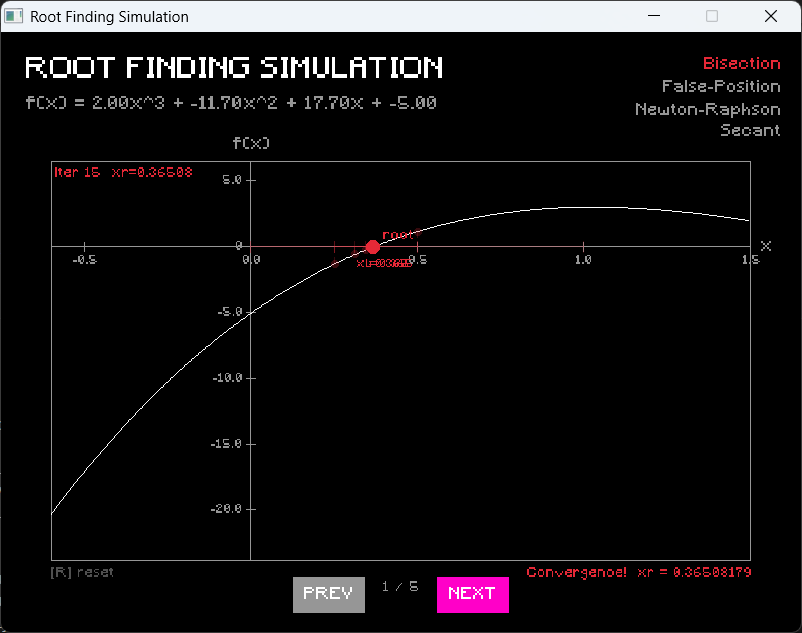
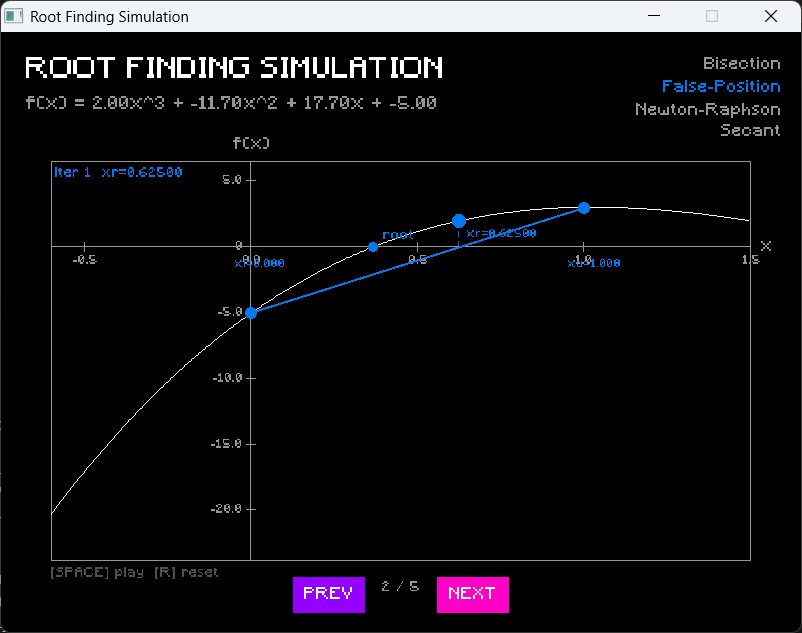
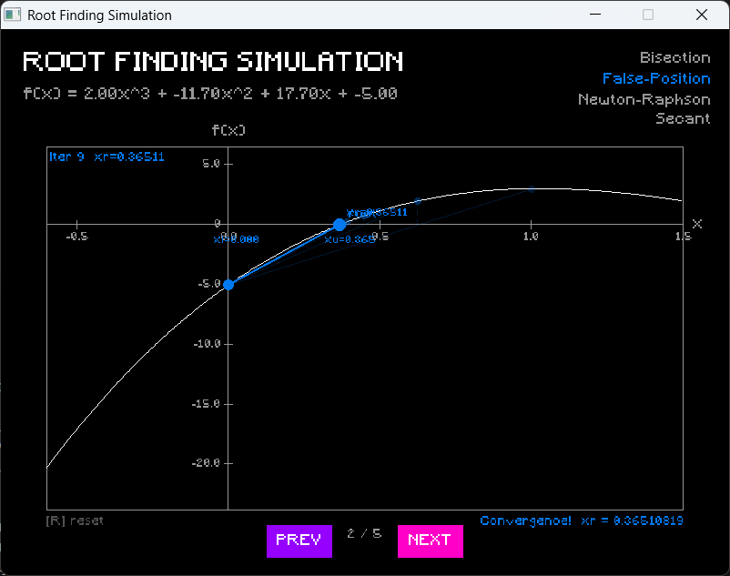
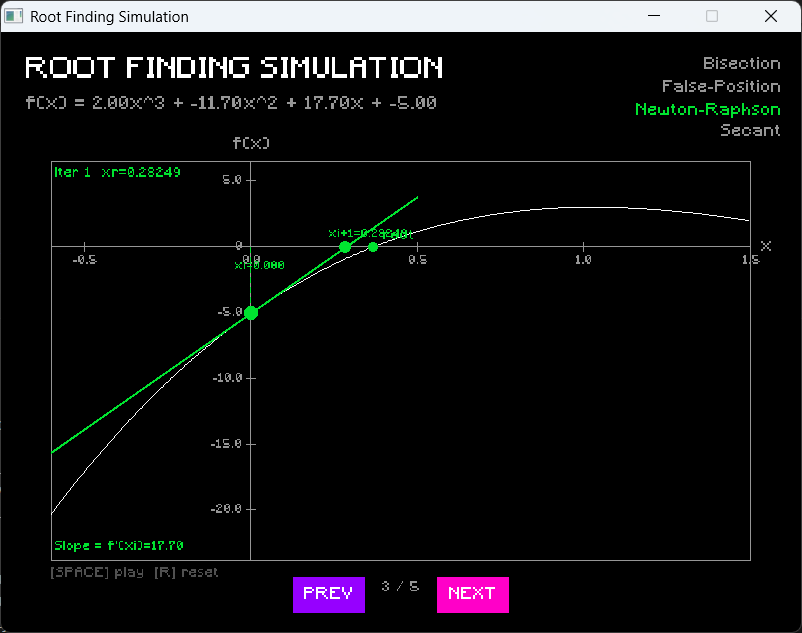
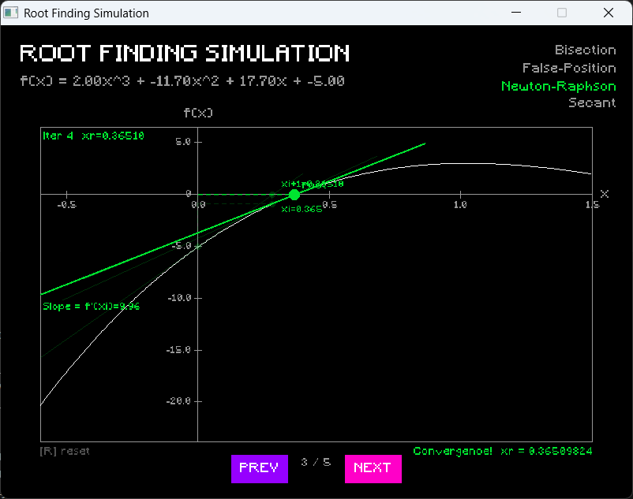
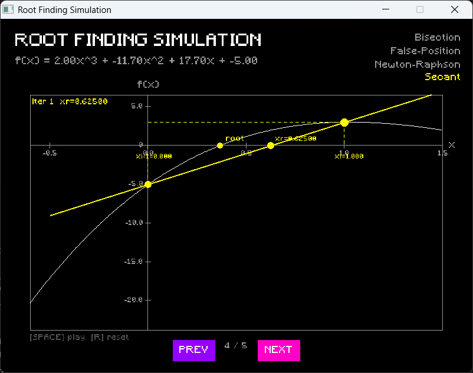
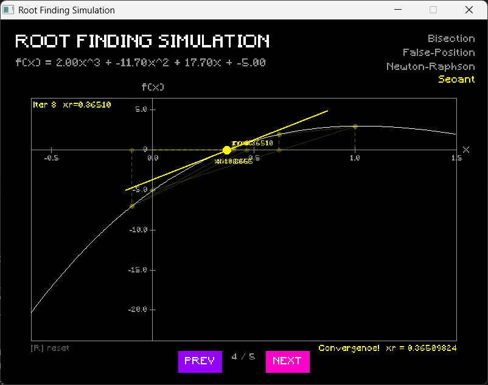
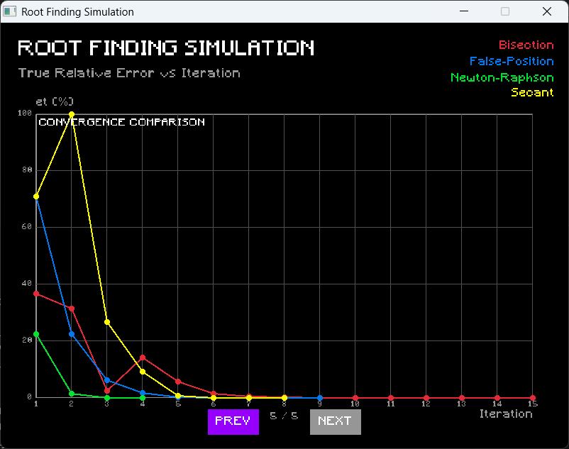

# 🧮 Kalkulator Root Finding — Polinomial & Euler

> **Final Project Praktikum Pemrograman C** — Program konsol berbasis C untuk mencari akar fungsi polinomial (linier, kuadratik, kubik) dan fungsi Euler menggunakan empat metode komputasi numerik, dilengkapi visualisasi grafis animasi interaktif berbasis Raylib.

---

## 👥 Kelompok 5

| Nama                           | NPM        |
| ------------------------------ | ---------- |
| Raden Ayu Athifah Qurrota'aini | 2406408230 |
| Annabell Della Sumantri        | 2406415040 |
| Keira Khairani Haqi            | 2406419562 |
| Dwidra Audric Farras           | 2406426265 |

---

## ✨ Fitur Utama

- **2 jenis fungsi:** Polinomial (linier, kuadratik, kubik) dan Euler (`e^(ax+b) + cx + d`)
- **4 metode numerik:** Bisection, False-Position, Newton-Raphson, Secant
- **Multi-metode sekaligus** dengan perbandingan hasil dan skoring otomatis (Borda Count)
- **3 mode berhenti iterasi:** Max Iteration, % Stopping Error, atau keduanya
- **True Relative Error (%et)** otomatis menggunakan akar terdekat dari xr (khusus polinomial)
- **Tabel iterasi** berformat dinamis dengan Unicode box-drawing characters
- **Analisis konvergensi** berdasarkan tren ea di 3 iterasi terakhir
- **Grafik simulasi animasi interaktif** step-by-step per metode (Raylib)
- **Slide konvergensi** — grafik et% vs iterasi untuk semua metode (khusus polinomial)
- **Validasi input berlapis** — menolak non-integer, non-double, out-of-range, dan edge case numerik

---

## 🖥️ Demo

### Output Terminal

Program menghasilkan tabel iterasi berformat rapi dengan Unicode box-drawing, analisis konvergensi, tabel rangkuman, dan tabel skoring:

```
Tabel Iterasi Metode Bisection

┌───────────┬────────────────┬────────────────┬────────────────┬────────────────┬────────────────┐
│  Iterasi  │       xl       │       xu       │       xr       │     ea (%)     │     et (%)     │
├───────────┼────────────────┼────────────────┼────────────────┼────────────────┼────────────────┤
│     1     │   0.00000000   │   1.00000000   │   0.50000000   │  100.00000000  │  36.94944007   │
│     2     │   0.00000000   │   0.50000000   │   0.25000000   │  100.00000000  │  31.52527996   │
│    ...    │      ...       │      ...       │      ...       │      ...       │      ...       │
│    15     │   0.36505127   │   0.36511230   │   0.36508179   │   0.00835911   │   0.00450735   │
└───────────┴────────────────┴────────────────┴────────────────┴────────────────┴────────────────┘

※   Analisis    :  ea terus menurun secara konsisten.
    Kesimpulan  :  xr konvergen untuk metode Bisection pada xr = 0.36508179 dengan ea = 0.00835911%.

Tabel Kesimpulan Hasil Komputasi Numerik

% Stopping Error : 0.01%

┌──────────────────┬───────────────┬───────────────┬───────────────┬───────────────┬───────────────┐
│      Metode      │    Iterasi    │      xr       │    ea (%)     │    et (%)     │  Konvergensi  │
├──────────────────┼───────────────┼───────────────┼───────────────┼───────────────┼───────────────┤
│    Bisection     │      15       │  0.36508179   │  0.00835911   │  0.00450735   │   Konvergen   │
├──────────────────┼───────────────┼───────────────┼───────────────┼───────────────┼───────────────┤
│  False-Position  │       9       │  0.36510819   │  0.00725747   │  0.00272519   │   Konvergen   │
├──────────────────┼───────────────┼───────────────┼───────────────┼───────────────┼───────────────┤
│  Newton-Raphson  │       4       │  0.36509824   │  0.00873939   │  0.00000027   │   Konvergen   │
├──────────────────┼───────────────┼───────────────┼───────────────┼───────────────┼───────────────┤
│      Secant      │       8       │  0.36509824   │  0.00011097   │  0.00000001   │   Konvergen   │
└──────────────────┴───────────────┴───────────────┴───────────────┴───────────────┴───────────────┘

Tabel Skoring Metode Komputasi Numerik

※   Konvergen = 1 | Divergen = 0 | Terkecil = 4 | Terbesar = 1

┌───────────────────────┬──────────────────┬──────────────────┬──────────────────┬──────────────────┐
│       Kriteria        │    Bisection     │  False-Position  │  Newton-Raphson  │      Secant      │
├───────────────────────┼──────────────────┼──────────────────┼──────────────────┼──────────────────┤
│  Positif Konvergensi  │        1         │        1         │        1         │        1         │
├───────────────────────┼──────────────────┼──────────────────┼──────────────────┼──────────────────┤
│   Iterasi Terkecil    │        1         │        2         │        4         │        3         │
├───────────────────────┼──────────────────┼──────────────────┼──────────────────┼──────────────────┤
│     %ea Terkecil      │        2         │        3         │        1         │        4         │
├───────────────────────┼──────────────────┼──────────────────┼──────────────────┼──────────────────┤
│     %et Terkecil      │        1         │        2         │        3         │        4         │
├───────────────────────┼──────────────────┼──────────────────┼──────────────────┼──────────────────┤
│         Total         │        5         │        8         │        9         │        12        │
└───────────────────────┴──────────────────┴──────────────────┴──────────────────┴──────────────────┘

※   Kesimpulan  :  Metode Secant adalah metode yang memberikan hasil komputasi paling baik dan cocok untuk f(x).
```

### Grafik Simulasi (Raylib)

Setelah kalkulasi selesai, program dapat membuka jendela simulasi animasi grafis interaktif.

**Bisection** — Iterasi 1 (bracket [0, 1], xr = 0.5) dan iterasi akhir (konvergen di xr ≈ 0.365):

[](docs/screenshots/bisection_iter1.png) [](docs/screenshots/bisection_final.png)

**False-Position** — Iterasi 1 (chord dari f(xl) ke f(xu)) dan iterasi akhir (konvergen di xr ≈ 0.365):

[](docs/screenshots/falsepos_iter1.png) [](docs/screenshots/falsepos_final.png)

**Newton-Raphson** — Iterasi 1 (garis tangen di xi=0, slope=17.70) dan iterasi akhir (konvergen dalam 4 iterasi):

[](docs/screenshots/newton_iter1.png) [](docs/screenshots/newton_final.png)

**Secant** — Iterasi 1 (chord antara xi-1=0 dan xi=1) dan iterasi akhir (konvergen di xr ≈ 0.365):

[](docs/screenshots/secant_iter1.png) [](docs/screenshots/secant_final.png)

**Convergence Comparison** — Grafik et% vs iterasi untuk semua metode (khusus polinomial):

[](docs/screenshots/convergence.png)

---

## 🗂️ Struktur Direktori

```
finpro-progc-kelompok5/
├── srcproject/
│   ├── finpro.c / finpro.h       ← main program & struct/enum global
│   ├── input.c / input.h         ← semua fungsi input & validasi
│   ├── output.c / output.h       ← cetak tabel iterasi, rangkuman, skoring
│   ├── evaluate.c / evaluate.h   ← evaluasi f(x), f'(x), true error
│   ├── methods.c / methods.h     ← 4 metode komputasi numerik
│   ├── simdata.c / simdata.h     ← write sim_data.txt & launch simulation.exe
│   └── simulation.c              ← grafik animasi Raylib (compile terpisah)
├── raylib/
│   └── src/
│       ├── libraylib.a           ← static library Raylib
│       ├── raylib.h              ← header Raylib
│       └── raymath.h             ← header math Raylib
├── resources/
│   └── minecraft/
│       └── Minecraft.ttf         ← font kustom untuk simulation.exe
├── docs/
│   └── screenshots/              ← screenshot grafik simulasi
└── README.md
```

---

## ⚙️ Cara Compile & Menjalankan

> **⚠️ Windows Only** — Program menggunakan `windows.h` (`CreateProcess`, `SetConsoleOutputCP`) dan hanya berjalan di Windows.

Semua perintah dijalankan dari **root direktori repo** hasil clone.

### 0. Clone Repo

```
git clone https://github.com/raden-ayu44/finpro-progc-kelompok5.git
cd finpro-progc-kelompok5
```

### 1. ⚠️ Set Encoding UTF-8

Program menggunakan karakter Unicode untuk tabel (┌ ┬ ┐ │ dll). Windows secara default menggunakan code page 437 yang tidak support Unicode, sehingga tabel akan berantakan tanpa langkah ini.

**Jalankan perintah ini setiap kali membuka terminal baru sebelum menjalankan program:**

```powershell
chcp 65001
```

Untuk VS Code, tambahkan ini di `settings.json` agar otomatis aktif setiap saat:

```json
"terminal.integrated.profiles.windows": {
    "PowerShell": {
        "source": "PowerShell",
        "args": ["-NoExit", "-Command", "chcp 65001"]
    }
},
"terminal.integrated.defaultProfile.windows": "PowerShell"
```

### 2. Compile `finpro.exe` — Program Utama (Konsol)

```
gcc srcproject/finpro.c srcproject/input.c srcproject/evaluate.c srcproject/methods.c srcproject/output.c srcproject/simdata.c -o finpro.exe -lm
```

### 3. Compile `simulation.exe` — Grafik Simulasi (Raylib)

```
gcc srcproject/simulation.c -o simulation.exe -Iraylib/src -Lraylib/src -lraylib -lopengl32 -lgdi32 -lwinmm -lws2_32 -lole32 -luuid -lshlwapi
```

> `simulation.exe` harus di-compile **sebelum** menjalankan `finpro.exe`. Jika belum ada, opsi "Tampilkan Grafik Simulasi" akan gagal.

### 4. Jalankan Program

```
.\finpro.exe
```

### Struktur setelah compile

```
finpro-progc-kelompok5/   ← root repo (jalankan semua perintah di sini)
├── finpro.exe            ← hasil compile step 1
├── simulation.exe        ← hasil compile step 2
├── sim_data.txt          ← ditulis otomatis saat runtime
├── srcproject/
├── raylib/
└── resources/
    └── minecraft/
        └── Minecraft.ttf
```

---

## 📖 Cara Penggunaan

Jalankan `finpro.exe`, lalu ikuti prompt secara berurutan:

| Langkah                     | Pilihan                                                       |
| --------------------------- | ------------------------------------------------------------- |
| **Jenis fungsi**            | `1` Polinomial / `2` Euler                                    |
| **Derajat polinomial**      | `1` Linier / `2` Kuadratik / `3` Kubik *(khusus polinomial)* |
| **Tampilan desimal**        | `4` / `6` / `8` angka desimal                                 |
| **Koefisien fungsi**        | Input nilai a, b, c, d sesuai jenis fungsi                    |
| **Metode**                  | Toggle `1`–`4` (bisa lebih dari satu), `0` untuk selesai      |
| **Mode berhenti**           | `1` Max Iter / `2` %ea / `3` Keduanya                         |
| **Bracket / initial guess** | Sesuai metode yang dipilih                                    |
| **Grafik simulasi**         | `1` Ya (buka `simulation.exe`) / `0` Tidak                    |
| **Lanjut / keluar**         | `1` Hitung lagi / `0` Keluar                                  |

### Contoh Sesi

```
Pilihan Jenis Fungsi        :  1   → Polinomial
Pilihan Derajat Polinomial  :  3   → Kubik
Pilihan Tampilan Desimal    :  8   → 8 angka desimal

Koefisien:  a=2, b=-11.7, c=17.7, d=-5
→ f(x) = 2.00000000x^3 + -11.70000000x^2 + 17.70000000x + -5.00000000
→ True Roots: xt_1=3.56316082 | xt_2=0.36509824 | xt_3=1.92174093

Metode dipilih: Bisection, False-Position, Newton-Raphson, Secant
Mode berhenti: %es = 0.01%
xl=0, xu=1  |  xi (NR)=0  |  xi-1=0, xi=1 (Secant)

[ Program menampilkan tabel iterasi tiap metode, tabel kesimpulan, dan tabel skoring ]

Apakah Anda ingin melihat Grafik Simulasi? → 1 (Ya)
Membuka Grafik Simulasi...

Apakah Anda ingin melanjutkan? → 0 (Keluar)
Terima kasih sudah menggunakan Kalkulator Root Finding kami!
```

---

## 🔢 Metode Numerik

### Bisection

Membagi interval `[xl, xu]` menjadi dua di setiap iterasi. Paling lambat konvergen namun paling stabil — dijamin konvergen selama IVT terpenuhi.

```
xr = (xl + xu) / 2
```

### False-Position (Regula Falsi)

Menggunakan interpolasi linear (chord) antara `f(xl)` dan `f(xu)`. Lebih cepat dari Bisection namun masih memerlukan bracket valid.

```
xr = xu - f(xu) * (xl - xu) / (f(xl) - f(xu))
```

### Newton-Raphson

Menggunakan garis tangen `f'(xi)` untuk memperkirakan akar berikutnya. Sangat cepat konvergen (konvergensi kuadratik) namun memerlukan turunan analitik.

```
xr = xi - f(xi) / f'(xi)
```

### Secant

Dua titik awal sebagai pengganti turunan. Hampir secepat Newton-Raphson tanpa memerlukan `f'(x)`.

```
xr = xi - f(xi) * (xi-1 - xi) / (f(xi-1) - f(xi))
```

---

## 🏆 Sistem Skoring (Borda Count)

Jika lebih dari satu metode dipilih, program menampilkan tabel skoring Borda Count:

| Kriteria            | Skor                                            |
| ------------------- | ----------------------------------------------- |
| Positif Konvergensi | Konvergen = 1, Divergen = 0                     |
| Iterasi terkecil    | Terkecil = N, Terbesar = 1                      |
| %ea terkecil        | Terkecil = N, Terbesar = 1                      |
| %et terkecil        | Terkecil = N, Terbesar = 1 *(hanya polinomial)* |

Metode dengan status **Divergen** didisqualifikasi dari kesimpulan akhir meskipun skor Borda-nya lebih tinggi.

---

## 🎮 Grafik Simulasi (simulation.exe)

Setelah kalkulasi selesai, user dapat memilih untuk membuka jendela grafik simulasi animasi:

- **Navigasi slide:** Tombol `PREV` / `NEXT` — satu slide per metode, plus slide konvergensi di akhir (khusus polinomial)
- **Animasi:** `[SPACE]` atau klik area grafik untuk memulai; `[R]` untuk reset ke iterasi pertama
- **Iterasi sebelumnya** ditampilkan dengan opacity lebih rendah (efek fade) untuk menunjukkan jejak pergerakan

| Metode         | Warna     | Visualisasi Geometri                                       |
| -------------- | --------- | ---------------------------------------------------------- |
| Bisection      | 🔴 Merah  | Bracket `[xl, xu]`, area semi-transparan, titik tengah xr  |
| False-Position | 🔵 Biru   | Garis chord dari `f(xl)` ke `f(xu)`, area segitiga         |
| Newton-Raphson | 🟢 Hijau  | Garis tangen di `f(xi)`, label slope `f'(xi)`              |
| Secant         | 🟡 Kuning | Garis chord antara dua titik terakhir, perpanjangan garis  |

Slide terakhir (khusus polinomial) menampilkan **grafik konvergensi** — plot et% vs iterasi untuk semua metode sekaligus dalam satu grafik.

---

## ⚠️ Batasan & Edge Case

| Kondisi                                   | Penanganan                                         |
| ----------------------------------------- | -------------------------------------------------- |
| `a = 0` pada semua fungsi                 | Ditolak — bukan fungsi derajat tersebut            |
| Diskriminan `< 0` pada kuadratik          | Ditolak — akar imajiner tidak dapat dicari         |
| `f(xl) * f(xu) > 0` pada bracket         | Ditolak — IVT tidak terpenuhi                      |
| `\|f'(xi)\| < 1e-10` pada Newton-Raphson   | Ditolak — turunan nol menyebabkan division by zero |
| `xi-1 = xi` pada Secant                  | Ditolak — pembagi nol                              |
| Fungsi Euler always-positive (`c=0, d≥0`) | Bisection & False-Position dinonaktifkan otomatis  |
| `\|xr\| > 10000` selama iterasi            | Iterasi dihentikan paksa (divergen ekstrem)        |

---

## 📋 Dependensi

| Komponen                  | Versi | Keterangan                            |
| ------------------------- | ----- | ------------------------------------- |
| GCC                       | ≥ 9.0 | Compiler C (C11+)                     |
| Raylib                    | 6.0   | Hanya untuk `simulation.exe`          |
| Windows API (`windows.h`) | —     | `CreateProcess`, `SetConsoleOutputCP` |

> Raylib hanya dibutuhkan untuk mengkompilasi `simulation.c` — `finpro.exe` tidak memerlukannya.

---

*Program Kalkulator Root Finding Polinomial & Euler — Final Project Praktikum Pemrograman C, Kelompok 5.*
